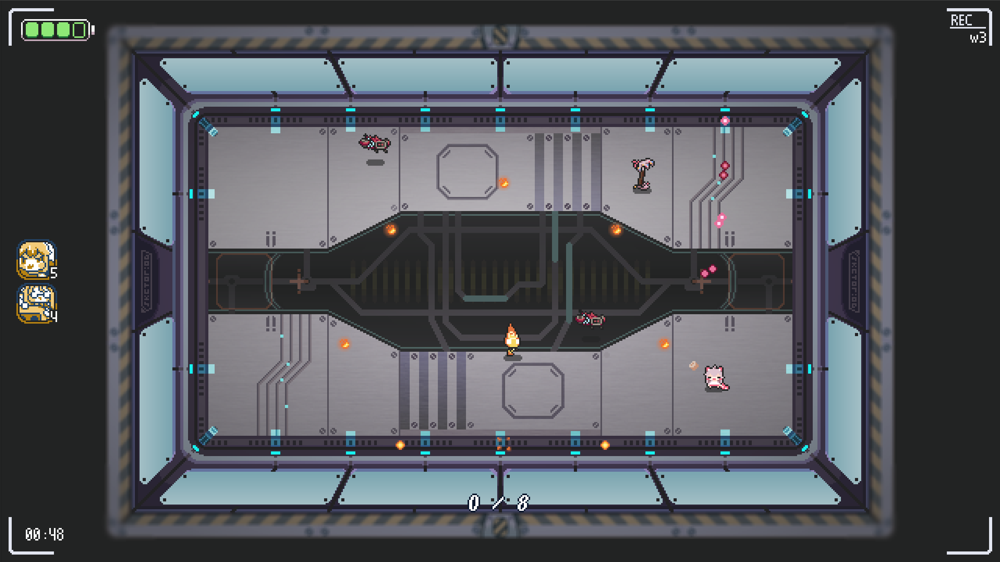
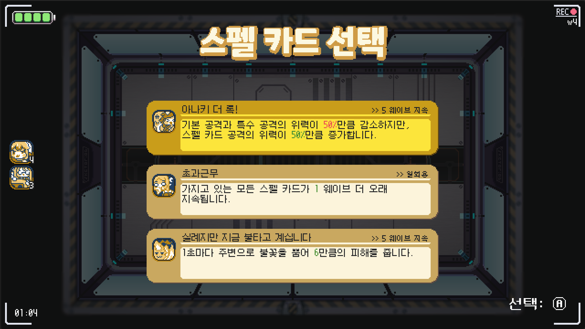
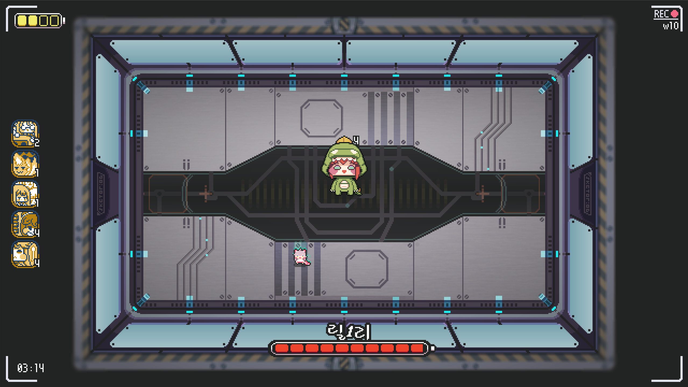
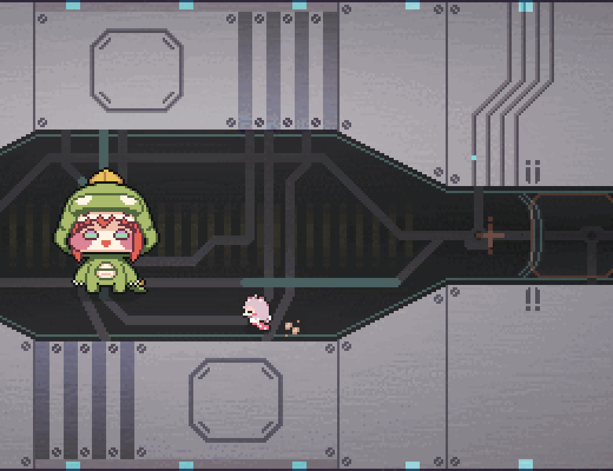

  

	<b>주의: 이 게임은 아직 테스트 버전이며, 정식 출시 버전이 아닙니다.</b>

## 다운로드
- [윈도우(Windows)](https://github.com/hyeon-in/Trickcal-Portal-Panic/releases/download/DEMO(v0.1.0)/Trickcal_Portal_Panic_DEMO_v0.1.0.zip)

# 개요

**트릭컬: 포탈 패닉**은 모바일 게임 "**트릭컬 리바이브**"의 비공식 팬게임으로, 몰려나오는 적들과 싸워서 살아남아야 하는 캐주얼 액션 게임입니다.

수인 마을에 사는 고양이 수인 코미와 강아지 수인 버터는 모종의 이유로 엘프 도시 모나티엄 어느 지하 연구실에 갇혔으며, 포탈에서 나오는 수 많은 몬스터들을 주말농장으로 보내버리고 탈출해야 합니다!

## 스크린샷

	
	
	
  

## 게임 플레이

### 특징
- 각 웨이브 마다 등장하는 모든 몬스터들을 쓰러뜨려야 합니다.
- 각 몬스터들은 고유한 능력과 행동 패턴을 가지고 있습니다.
- 매 웨이브가 끝날 때마다 캐릭터에게 여러 효과를 부여하는 세 가지의 스펠 카드 중 하나를 선택해야 합니다. 선택한 스펠 카드는 일정 웨이브가 지나면 사라집니다.
- 10번째 웨이브마다 강력한 보스 몬스터가 등장합니다. 

### 체험판 정보
- 플레이어 캐릭터는 코미만 선택할 수 있습니다.
- 총 10 웨이브까지 있습니다.
- 4종류의 일반 몬스터와 1종류의 보스 몬스터가 등장합니다.

### 정식 버전에서 추가될 요소들
- 새로운 플레이어 캐릭터로 버터가 추가됩니다. 버터는 새총을 활용한 장거리 전투에 특화되어 있습니다.
- 총 30 웨이브까지 진행됩니다.
- 더욱 다양한 종류의 일반 몬스터들이 등장하며, 총 3종류의 보스 몬스터가 등장합니다.
- 10번째 웨이브를 클리어할 때마다 한 웨이브에서 나오는 적의 수가 늘어나며, 보스 몬스터의 공격 패턴이 강화됩니다.
- 30 웨이브를 넘어서도 게임을 계속할 수 있는 별도의 무한 모드가 추가됩니다.

## 조작법
- **키보드**
	- **방향키: 이동**
 	- **기본 공격: Z**
 	- **특수 공격: X**

- **게임패드(XBOX 컨트롤러 기준)**
	- **왼쪽 스틱, 십자키: 이동**
	- **기본 공격: X**
	- **특수 공격: Y**

## 개발 세부사항
- **게임 엔진:** Godot Engine(v4.2.2)
- **개발 언어:** GDScript
- **게임 아트:** Aseprite
- **개발 기간:** 2023년 12월~ 개발 중
- **역할:** 1인 개발

## 크레딧

### 게임 개발
- [Hyeonin(현인)](https://linktr.ee/hyeonin) - 프로그래밍 및 아트

### 원작 게임: 트릭컬 리바이브
- **개발사: (주)에피드게임즈**
  - [웹사이트](https://epidgames.com/)
- **관련 사이트:**
  - [웹사이트](https://trickcal.com/)
  - [유튜브](https://www.youtube.com/@epidgames6350)
  - [X(트위터)](https://twitter.com/Trickcal_Re)
  - [인스타그램]( https://www.instagram.com/trickcal.revive?igshid=YzAwZjE1ZTI0Zg%3D%3D)
  - [네이버 카페](https://cafe.naver.com/trickcal)
  - [네이버 라운지](https://game.naver.com/lounge/Trickcal/home)
- **다운로드:**
  - [Google Play Store](https://play.google.com/store/apps/details?id=com.epidgames.trickcalrevive)
  - [App Store]( https://apps.apple.com/kr/app/%ED%8A%B8%EB%A6%AD%EC%BB%AC-revive/id6443824730)

### 음악

원곡
- Warak
  - [유튜브](https://www.youtube.com/@Warak)
  - [사운드클라우드](https://soundcloud.com/waraku)

어레인지
- Nyan Nut
  - [유튜브](https://www.youtube.com/@NutNyan/)
	- *Trickcal RE VIVE Stage Theme*

- AlcheJ
  - [유튜브](https://www.youtube.com/@Alchej)
	- *Trickal monatium retro night*

### 효과음

- [Universal Sound FX](https://imphenzia.com/universal-sound-fx)

### 폰트
- [갈무리](https://galmuri.quiple.dev/)
- [도스샘물체](https://github.com/hurss/fonts)
- [Neo둥근모](https://neodgm.dalgona.dev/)
- [ONE 모바일 POP](https://www.onestorecorp.com/sv/fordev_font/)

### 외부 플러그인
- [Importality](https://github.com/nklbdev/godot-4-importality)

## 참고
1. **본 게임은 (주)에피드게임즈 사의 모바일 게임 '트릭컬 리바이브'와는 전혀 관계가 없는 비공식 팬게임입니다.**
2. **본 게임은 어떠한 상업적 목적 없이 개인적인 창작 활동으로 제작되었습니다.**
3. **게임 제작에 있어 원작 게임 내의 어떠한 리소스도 사용되지 않았습니다.**
4. **본 게임은 (주)에피드게임즈 사에서 공개한 [트릭컬 리바이브 2차 창작물 가이드라인](https://epidgames.oqupie.com/portal/2399/article/50943)을 준수하여 제작되었습니다.**
